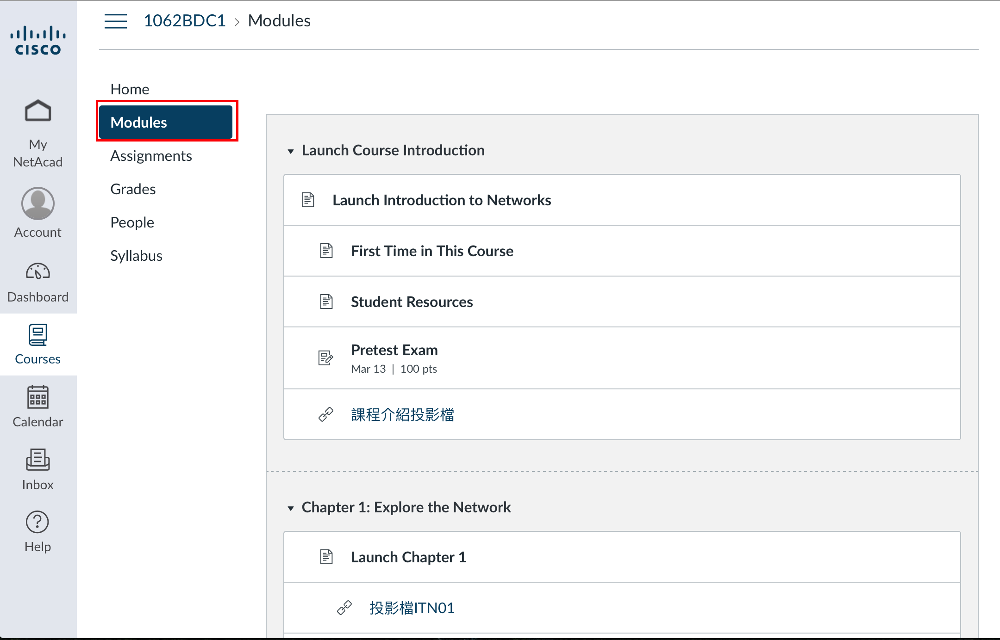

### 企業資料通訊TA 0

---

### 課程說明
先自我介紹一下，我是黃存宇(106356036@nccu.edu.tw)

---

TA課主要會做什麼呢???

---

~~抓寶可夢~~ 

---

1. 完成Packet Tracer的練習
2. 上一些資安
3. 身為一個程式設計師要有的基礎網路知識

---

那假設大家上午都有認真聽課，  
下面這三個連結相信大家都會很熟悉

* [NetAcad](https://www.netacad.com)
* [1062企業資料通訊](https://www.facebook.com/groups/189937851590771/)
* [WM5](https://wm5.nccu.edu.tw/mooc/index.php)

---

### 那就開始啦

---

這禮拜要做的事情就是安裝Packet Tracer進行Pretest

---

---

沒有Flash!!請開啟!!

---

之後的投影片或繳交作業之類的，  
就在社團及WM5公告

---

有任何問題?  
就在FB社團裡發問/FB私訊/寄信  
很歡迎大家問任何問題