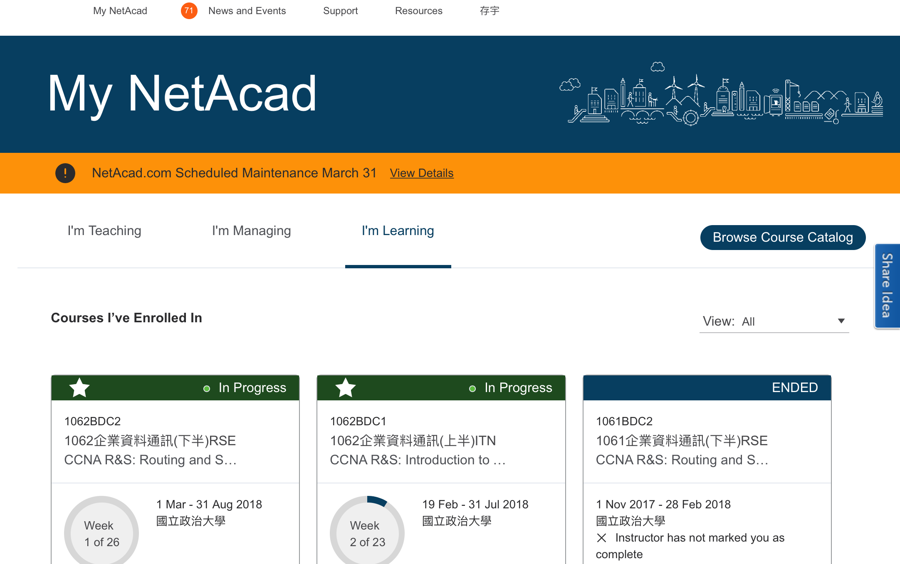

### 企業資料通訊TA 0

---

 goo.gl/LiNPag 

---

### 課程說明
先自我介紹一下，我是黃存宇(106356036@nccu.edu.tw)

---

TA課主要會做什麼呢???

---

~~抓寶可夢~~ 

---

1. 完成Packet Tracer的練習
2. 上一些資安
3. 身為一個程式設計師要有的基礎網路知識

---

那假設大家上午都有認真聽課，  
下面這三個連結相信大家都會很熟悉

* [NetAcad](https://www.netacad.com)
* [1062企業資料通訊](https://www.facebook.com/groups/189937851590771/)
* [WM5](https://wm5.nccu.edu.tw/mooc/index.php)

---

### 那就開始啦

---

這禮拜要做的事情就是安裝Packet Tracer進行Pretest

---

先來安裝 Packet Tracer

---

那請先登入剛剛提到的 [NetAcad](https://www.netacad.com)

---

理論上是你的學校信箱當帳號，密碼是你用連結信連過去時設的密碼

---

登入的畫面長這樣

---

1. 請選 ITN 這堂課
2. 並點 Module
3. 點 Student Resources

---

---

接著就可以下載 Packet Tracer (Student Version)

---

那這裡先說一件事，建議若大家要用自己的電腦  
要用 Windows 裝 Packet Tracer

---

Mac也是有辦法裝 Packet Tracer，但是要用模擬器  
(方法我再公布在社團或之後再更新投影片)

---

要是你是開機就是 linux ，我相信你很厲害  
~~助教課你應該都不用來了這樣~~  
~~你應該還是可以聽到一些東西這樣XD~~

---

那安裝完了之後，你應該就可以  
進行 Pretest 跟 Chapter 1 Exam

---

---

沒有Flash!!請開啟!!

---

之後的投影片或繳交作業之類的，  
就在社團及WM5公告

---

有任何問題?  
就在FB社團裡發問/FB私訊/寄信  
很歡迎大家問任何問題