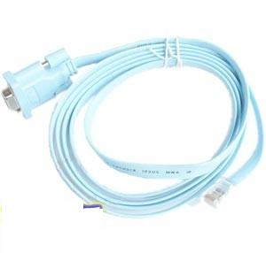
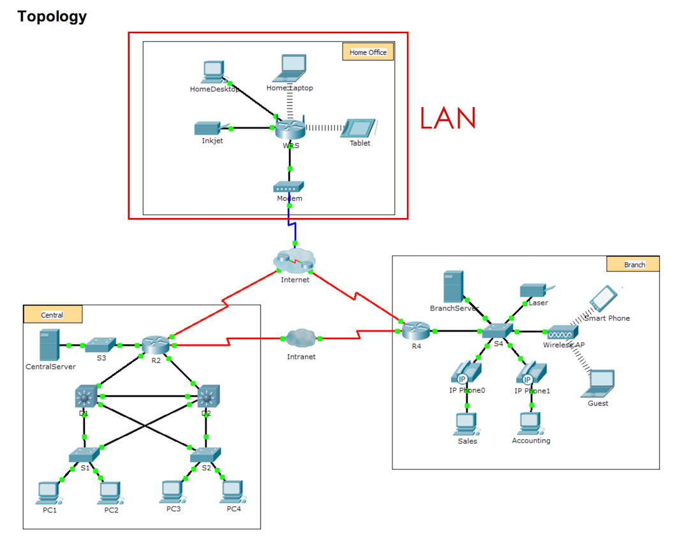
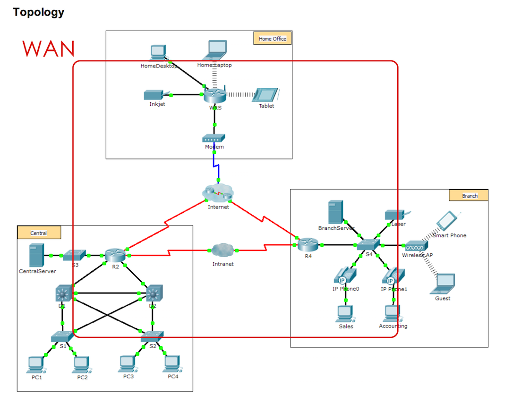

### 企業資料通訊TA 1

---

<p style="font-size:150px;"> goo.gl/LiNPag </p>

---

還沒加入社團的同學請記得  
在FB直接搜尋 `1062企業資料通訊`  後加入

---

評分說明

---

[TA課評分方式]  
* 助教共有15%的分數，共有15次簡單小作業要完成  
* 每次小作業佔的%數都是1%，都有一到數項要求需要完成，平均配分  
* 作業有問題可以先詢問助教或參考投影片，不補交

---

目標：
* 了解 Packet Tracer 環境
* 了解 WAN/LAN
* 嘗試CISCO IOS

---

請大家先下載 
* [Netcad 1.2.4.4](https://1387926.netacad.com/courses/639250/pages/launch-chapter-1) 
* [Netcad 1.2.4.5](https://1387926.netacad.com/courses/639250/pages/launch-chapter-1) 
* [Netcad 2.3.2.5](https://1387926.netacad.com/courses/639250/pages/launch-chapter-2)

這三個 pka 檔

---

第一次因為練習比較簡單  
所以會需要下載比較多個 pka

---

* 了解 Packet Tracer 環境

---

在這裡，最主要就是了解

1. Simulator mode(右下)
2. Logical physical(左上)

---

可以參考 [Netcad](https://1387926.netacad.com/courses/550021/pages/launch-chapter-1) 1.2.4.4

---

* 了解 WAN/LAN

---

接著，要來看一下什麼叫 WAN / LAN 啦

---

打開 [Netcad](https://1387926.netacad.com/courses/550021/pages/launch-chapter-1) 1.2.4.5 所附的pka檔

---

啊!不過要先來介紹組成網路的最基礎設備

---

在 Packet Tracer 中  
左下角可以看到這些基礎設備的網路建設

---

像是網路設備、終端設備、線材等

---

像是老師早上上課有講過的這條線，  
稱為console線，用來連線到設備使用console的  
那在 packet tracer 也可以找到對應的線材



Ref: [CCNA Cisco密碼設定----console篇](http://netx34.pixnet.net/blog/post/580440-ccna-cisco%E5%AF%86%E7%A2%BC%E8%A8%AD%E5%AE%9A----console%E7%AF%87)

---

接下來就回到 1.2.4.5

---

LAN 區域網路



---

WAN 廣域網路



---

可以參考 [Netcad](https://1387926.netacad.com/courses/550021/pages/launch-chapter-1) 1.2.4.5

---

* 嘗試CISCO IOS

---

打開[Netcad 2.3.2.5](https://1387926.netacad.com/courses/639250/pages/launch-chapter-2)

---

CISCO IOS 基本上是用指令操作的  
請大家多多學習啦

---

首先要講一些基本設定，那挑個switch試試

---

在遇到不熟悉的指令時，在cisco的環境下可以打 `?`  
指令太長，可以打一兩個字後按`tab`補全

---

啟動特權

以下的程式皆為一行一行執行

```cmd
?
enable
?
```
你可以看到前後可執行指令的差別

---

接下來的設定，請確定在特權模式(root)底下

---

設定時會先打 
```cmd 
configure terminal
或是
configure t
```
來做設定

---

指定名稱為 s1hahaha

```cmd
enable
configure terminal

hostname s1hahaha

exit
show running-config //顯示當前配置
```
---

那這次先教到這裡，下次再補完 2.3.2.5 的部分

---

### 作業來啦!!!

---

作業的要求：  

1. 請找出 Simulator mode / Logical physical
2. 請給我 LAN 跟 WAN 的圖
3. show running-config 的 hostname 內容為你的"學號"

---

繳交方式：

1. 將做完的要求截圖後做成一份"文件"，上傳到 WM5 的作業一
(pdf,word或者 [markdown](http://markdown.tw))

---

繳交時間:

下禮拜三TA課前