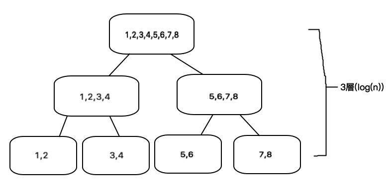

### 企業資料通訊TA 13

---

<p style="font-size:150px;"> ppt.cc/fl8pwx </p>

---

目標：

* RSE Practice Skills Assessment Part 1 - PT
* 猜密碼回顧

---

先提醒大家要把作業、測驗這樣才有分數啊  
feedback做完，下禮拜才可以考試啊

---

那就來開始講今天的內容吧

---
 
[RSE Practice Skills Assessment Part 1 - PT](https://1387926.netacad.com/courses/639250/assignments)  

---

跟上禮拜的部分大同小異  
基本上是多了NTP(第十章)的部分

---

請看小視窗的題目  
一樣老方法-接console線

---

* Step1: Basic Device Configuration  
    Complete a basic device configuration on the HQ router. Perform the following tasks:
    * Disable DNS lookup.
    ```
    no ip domain-lookup 
    ```
    * Configure the device with the name shown in the addressing table.
    ```
    hostname HQ
    ```
    * Configure password encryption.
    ```
    service password-encryption 
    ```
    
---

* Step1: Basic Device Configuration  
    Complete a basic device configuration on the HQ router. Perform the following tasks:
    * Assign the encrypted type of privileged EXEC password.
    ```
    enable secret cisco
    ```
    * Configure a MOTD banner to warn users that unauthorized access is prohibited.
    ```
    banner motd $unauthorized access is prohibited$
    ```
    
---

* Step1: Basic Device Configuration  
    Complete a basic device configuration on the HQ router. Perform the following tasks:
    * Configure the console line so that router status messages will not interrupt command line input.
    ```
    line console 0
    logging synchronous
    ```
    * Configure the console to require a password for access.
    ```
    password cisco
    login 
    exit  #離開這條線的設定
    ```
---

* Step1: Basic Device Configuration  
    * Configure the VTY ports to only accept connections over SSH. Use the following values...
    ```yaml
    ip domain-name cisco.com
    username admin password class
    crypto key generate rsa
    #輸入1024
    ip ssh version 2
    line vty 0 15
    transport input ssh
    login local 
    exit 
    ```
    
---

* Step 2: Interface Addressing HQ
    Activate and configure the G0/1 and S0/0/0 interfaces of the HQ router with the IP addresses given in the Addressing Table. 
    The G0/0 interface will be configured later in the assessment. Configure descriptions for these interfaces.
   
    ```
    int g0/1
    ip address 192.168.2.1 255.255.255.0
    no shutdown 
    description g01
    ```
    ```yaml
    int s0/0/0
    ip address 10.1.1.1 255.255.255.252
    #255.255.255.252即為 11111111.11111111.11111111.11111100
    no shutdown 
    description s000
    exit
    ```
    

---

* Step 3: VLANs and Trunking
    Configure the SW-Bldg-A, SW-Bldg-A-1, and SW-Bldg-A-2 switches with VLANs and trunking according to the values in the VLAN table.
    * Add the VLANs to the switches.
    * Name the VLANs exactly as shown in the VLAN table.
    * Assign the appropriate ports to the VLANs.
---
    ```
    #XXX是根據你的Addressing Table設定的
    enable 
    configure terminal 
    vlan 5
    name XXX
    vlan 10
    name XXX
    vlan 15
    name XXX
    vlan 50
    name XXX
    exit
    ```
---

* Step 3: VLANs and Trunking
    * Configure the links between the SW-Bldg-A, SW-Bldg-A-1, and SW-Bldg-A-2 switches as trunks. Configure the link between SW-Bldg-A and HQ as a trunk. All trunking interfaces should be statically configured as trunks.
---

```yaml
#以下是根據switch做設定的
int g0/1
switchport mode trunk
int f0/23
switchport mode trunk
int f0/24
switchport mode trunk
int f0/5
switchport mode access
switchport mode vlan 5
int f0/10
switchport mode access
switchport mode vlan 10
int f0/15
switchport mode access
switchport mode vlan 15
int f0/20
switchport mode access
switchport mode vlan 50

```

---

* Step 4: Routing Between VLANs  
    Configure routing between VLANs on the HQ router. Use the information in the addressing and VLAN tables.

    在設定前  
    先根據Address Table算subnet吧!!
---

Subnet 192.168.1.XXX

|Network Address | Default Gateway|IP Range|Broadcast|
|:-:|:-:|:-:|:-:|
|0|1|2-14|15
|16|17|18-30|31|
|32|33|34-46|47|
|48|49|50-62|63|

--- 

```
int g0/0.5
encapsulation dot1Q 5
ip address 192.168.1.1 255.255.255.240

int g0/0.10
encapsulation dot1Q 10
ip address 192.168.1.17 255.255.255.240

int g0/0.15
encapsulation dot1Q 15
ip address 192.168.1.33 255.255.255.240

int g0/0.50
encapsulation dot1Q 50
ip address 192.168.1.49 255.255.255.240
exit

int g0/0
no shutdown 
exit 
```

---

* Step 5: Access Control List Configuration
    Configure a named standard ACL that meets the following requirements:
    * The list should be named block15. The name must match this value exactly in order for you to receive credit for your work.
    * Prevent any host with an address on the VLAN15 subnetwork from accessing the VTY lines of HQ.
    * All other hosts should be permitted
---
    ```
    ip access-list standard block15
    deny 192.168.1.32 0.0.0.15
    permit any
    exit
    line vty 0
    access-class block15 in
    exit
    ```
---

* Step 6: Switch Virtual Interface (SVI) Configuration  

    Configure the switch virtual management interfaces on SW-Bldg-A, SW-Bldg-A-1, and SW-Bldg-A-2. Use the information in the addressing and VLAN tables for your configuration. All switches should be reachable from hosts on other networks for the purpose of this assessment.
    ```
    enable
    config t
    int vlan 50
    ip address XXX 255.255.255.240
    no shutdown 
    exit 
    ip default-gateway 192.168.1.49
    ```
---

*  Step 7: Switch Port Security Configuration
    Improve network security by configuring the SW-Bldg-A-1 switch with the following. You are only required to configure these settings on this one switch for this assessment.
    * Disable ALL unused switch ports.
    ```
    int range f0/1-4, f0/6-9, f0/11-14, f0/16-19, f0/21-22, f0/24, g0/1-2
    shutdown
    ```
    * Activate port security on all ports that have hosts connected.
    ```
    int range f0/5, f0/10, f0/15, f0/20,f0/23
    switchport port-security 
    ```
---
*  Step 7: Switch Port Security Configuration
    * Allow only a maximum of two MAC addresses to access the active switch ports.
    ```
    switchport port-security maximum 2
    ```
    * Configure the switch ports to automatically learn the two allowed MAC addresses and record the addresses in the running configuration.
    ```
    switchport port-security mac-add sticky
    ```
    * Configure the switch ports so that, ... a violation has occurred is not required.
    ```
    switchport port-security violation protect
    ```
---

*  Step 8: Dynamic Routing
    Configure RIPv2 routing on HQ and Branch.
    * Configure RIPv2 on HQ and Branch so that all networks are reachable.
    * Configure all LAN physical interfaces so that RIP updates are not sent out to the LANs.
    * Be sure to use the version of RIP that supports classless routing.
    * Prevent RIP from automatically summarizing networks.
    * Configure RIP to automatically send the default route that is already configured on Branch to HQ.

---

```
#HQ
#設定RIP模式
enable
config t
router rip
version 2
# do show ip route connected #顯示路由相關連線資訊

#設定network
network 10.1.1.0
network 192.168.1.0
network 192.168.1.16
network 192.168.1.32
network 192.168.1.48
network 192.168.2.0

no auto-summary #不要auto-summary

#設定interface
passive-interface g0/0.5
passive-interface g0/0.10
passive-interface g0/0.15
passive-interface g0/0.50
passive-interface g0/0
passive-interface g0/1
exit
```
---

```
#Branch
#do show ip route connected
network 10.1.1.0
network 192.168.3.0
default-information originate #自動傳播預設路由
no auto-summary
passive-interface s0/0/1
passive-interface g0/0
```

---
*  Step 9: Configure Network Monitoring
    Configure NTP and Syslog server logging on HQ.
    * Activate the logging and debug timestamp services.
    ```
    service timestamps log datetime msec
    service timestamps debug datetime msec
    ```
    * Configure HQ as an NTP client. The NTP server is ADMIN with the address of 192.168.2.10.
    ```
    ntp server 192.168.2.10 
    ```
---
*  Step 9: Configure Network Monitoring
    * Configure Syslog to send debug level messages to the ADMIN logging server.
    ```
    logging 192.168.2.10
    logging trap debugging
    ntp update-calendar
    ```
---

* Step 10: Configure Host Addressing
    Address the hosts that are connected to SW-Bldg-A-1 so that they have connectivity to the IP address of the Web server on the Internet. Use the information provided in the Addressing Table.

---

* OFFICE 1
    * 192.168.1.0/28 first subnet, any available address
* PROD-1
    * 192.168.1.0/28 second subnet, any available address
* ACCT 1
    * 192.168.1.0/28 third subnet, any available address
* ADMIN-1
    * 192.168.1.0/28 fourth subnet, any available address

---

|IP | SUBNET MASK |DEFAULT GATEWAY|
|:-:|:-:|:-:|
|192.168.1.10|255.255.255.240|192.168.1.1|
|192.168.1.20|255.255.255.240|192.168.1.17|
|192.168.1.40|255.255.255.240|192.168.1.33|
|192.168.1.60|255.255.255.240|192.168.1.49|

---

這禮拜的PT上完啦

---

### 猜密碼回顧

---

大家集思廣益得到的方法有以下幾種：

---

5. 從a試到Z(人工窮舉法)(時間複雜度:Big-O(n))
3. 猜aeiou
4. 用_猜位置及長度
6. 排列組合26個英文字母
7. 寫程式暴力破解(電腦窮舉法)
8. 電腦科學就是try&error
9. 發現有不少人帳號叫elwood

---

每個方法都是能夠加速自己猜的速度!!

---

這邊提供一個綜合大家答案的流程  
給大家參考

---

我們一開始得到的提示是  
`__w%d%`

---

先確定長度，用_ 或是  
' OR ... name = 'jake' and length(password) = XXX) AND ''='

---

得到長度後，先找出w跟d的位置

---

單字通常會有母音，先猜aeiou

---

所以知道有deow後可以知道位置  
這時的情報是這樣: `e_wo_d`

---

剩下兩個的話，可以先用語感猜後面的wood或word

---

或是不要的話，直接暴力26個字母嘗試兩次

---

也有同學直接寫程式直接對網頁發request  
將四個字母找出來的  

---

還有另一種做法是有同學寫出來的

```
' OR EXISTS(SELECT * FROM users WHERE name='jake' AND SUBSTR(password,5,1) BETWEEN 'k' AND 'p' ) AND ''='
```

---

這個可以讓時間複雜度從$O(n)$降到$O(log{n})$

---

示意圖(8個數字，最多找log(8)=3次)



---

### 最後

---

俗話說得好：學也無涯

---

記得景堯老師有說他下學期要開資安的課XD

---

舜文老師開的課程
* [Advanced Technologies and  Services Laboratory](https://sites.google.com/view/mikehsiao/home)  
(從Teaching那可以找自己有興趣的課程pdf)

---

之前在政大教過IOS的老師所做的課程
* [IOS with Swift](https://course.sodas.tw/syllabus.html)

---

可以訂閱的資訊週報
* [TECHBRIDGE WEEKLY 技術週刊](https://weekly.techbridge.cc/)
* [CodeTengu Weekly 碼天狗週刊](https://weekly.codetengu.com/)

---

### 作業來啦!!!

---

作業的要求：  
1.線上點名啦  
#### 這次作業時間開放到助教課結束(6/21,23:59)

---

繳交方式：

1. 直接點到 WM5 的 作業十三按下上傳鍵吧

---

繳交時間:

這禮拜TA課結束前(6/21,23:59)