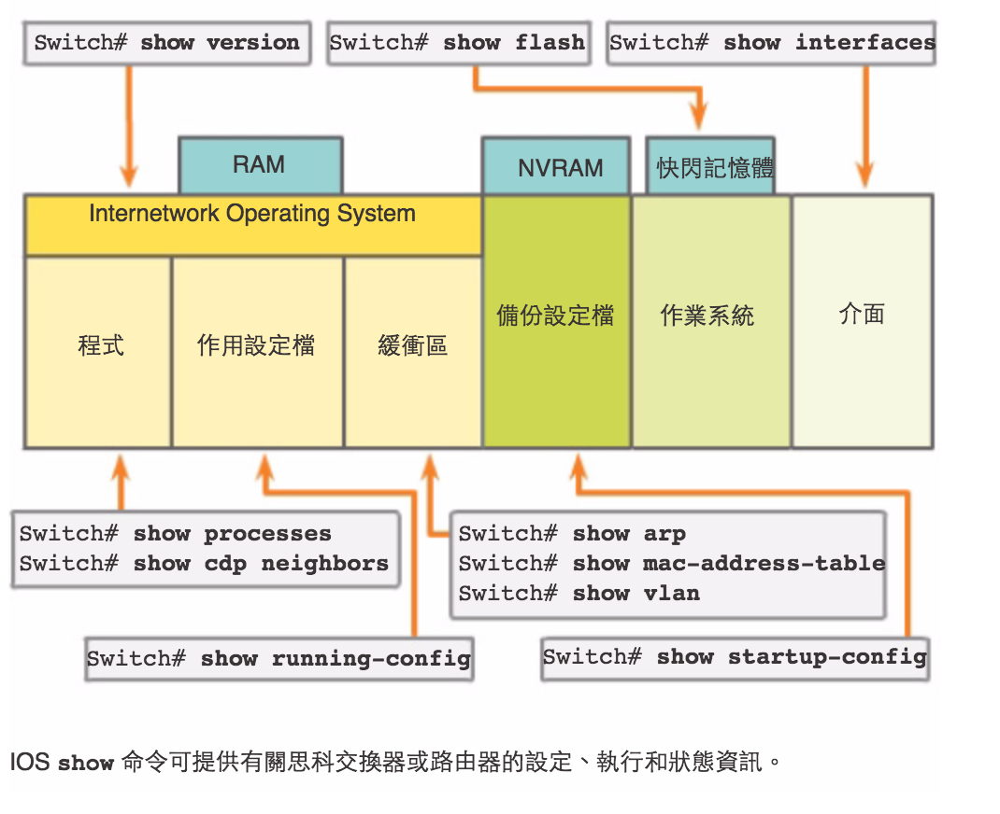
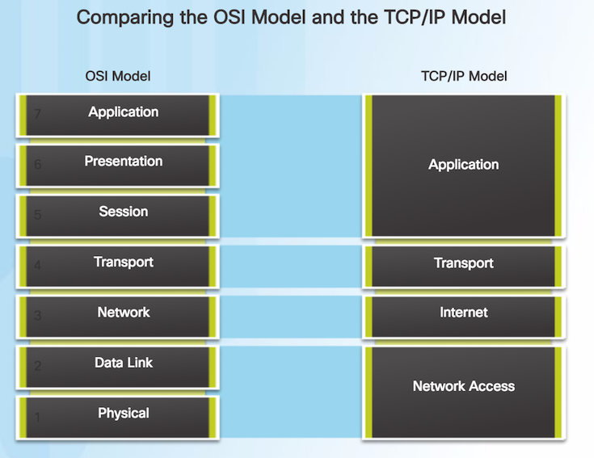
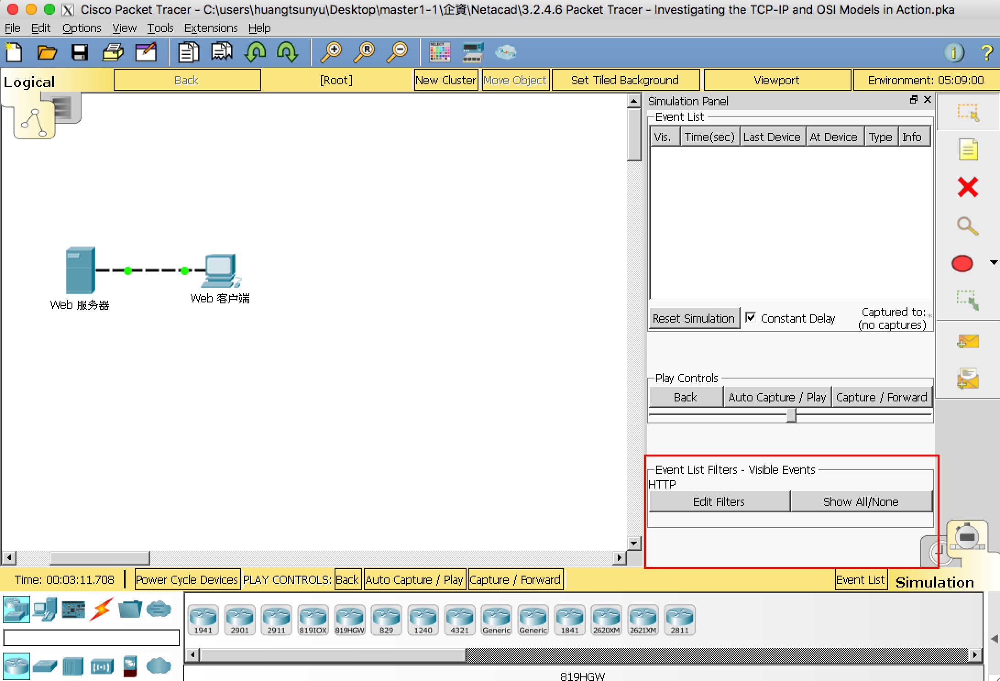
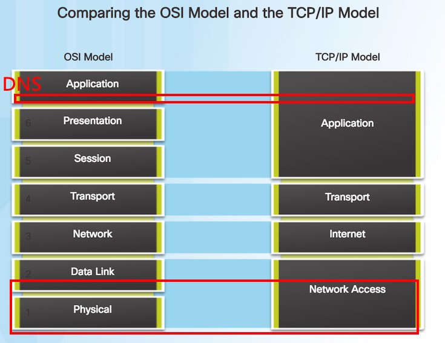
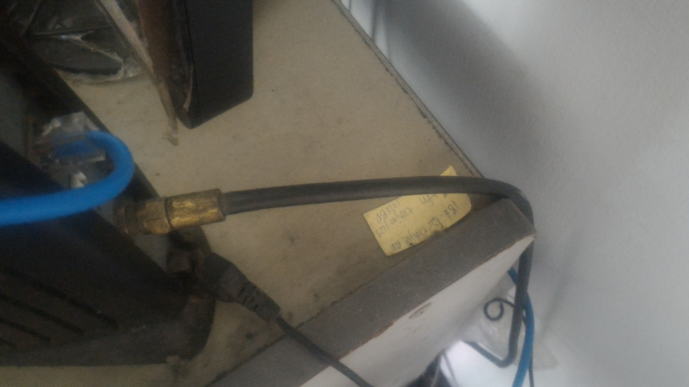
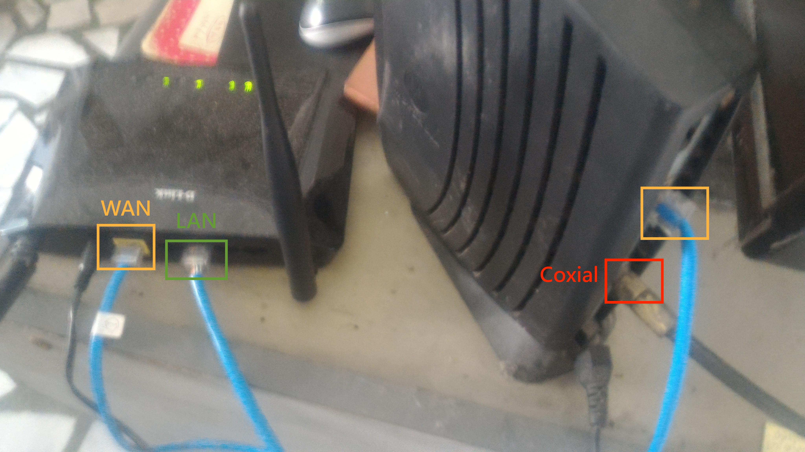
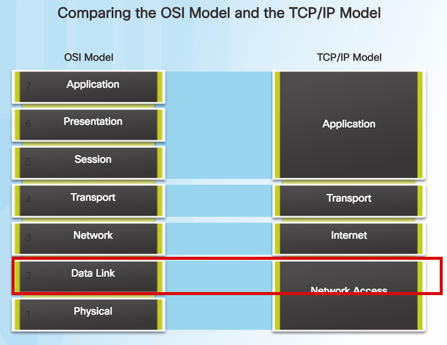
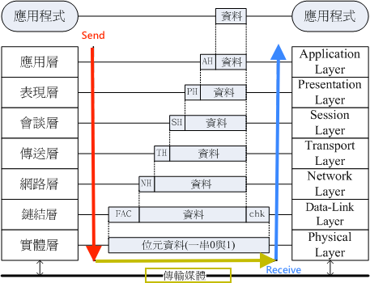
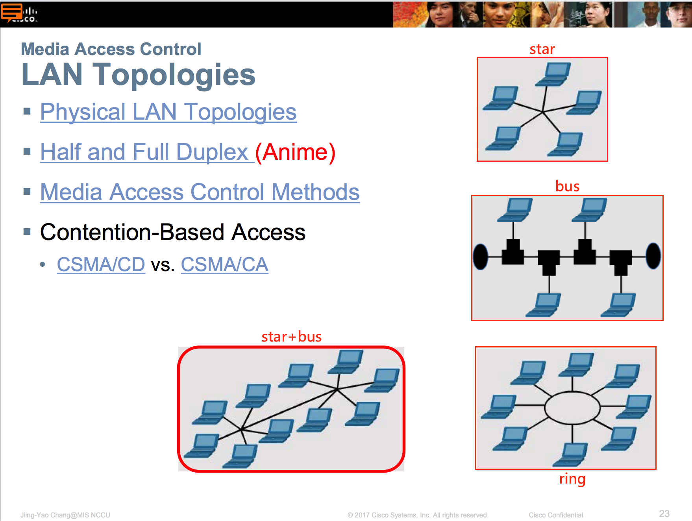
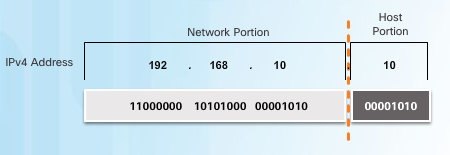

### 企業資料通訊TA 3

---

<p style="font-size:150px;"> goo.gl/LiNPag </p>

---

目標：

* 藉由查看PDU，更加認識OSI七層
* Layer 1 - 理解各個線材與設備之間的關係
* Layer 2 - Data Link Layer : MAC/ARP

---

請大家先下載 
* [Netcad 3.2.4.6](https://1387926.netacad.com/courses/639250/pages/launch-chapter-3) 
* [Netcad 4.2.4.4](https://1387926.netacad.com/courses/639250/pages/launch-chapter-4) 
* [Netcad 5.3.2.8](https://1387926.netacad.com/courses/639250/pages/launch-chapter-5) 

---

恩...因為少一個禮拜的關係...  
今天的東西比較多...

---

前次複習:
* [PT]嘗試CISCO IOS

---

那在進入這禮拜助教課前之前  
先來複習一下上禮拜教的

---


<p style="font-size:15px">來源：陳振庸老師</p>

---

接下來就進入 ITN CH3 啦

---

### 藉由查看PDU，更加認識 OSI 七層

---

首先介紹PDU(Protocol Data Unit)

---

看一下[維基](https://zh.wikipedia.org/wiki/协议数据单元)怎麼介紹它的

---

OSI 7層，大家應該都不陌生吧?

---



---

接下來的幾堂正課及助教課  
會開始講這幾層，大家要好好跟它相處啊

---

那就打開 [Netcad 3.2.4.6](https://1387926.netacad.com/courses/639250/pages/launch-chapter-3)

---

先從 Web Client(Web客戶端) 發一個 request 到  
Web Server(Web伺服器/服務器)吧

---

點選Web Client -> Desktop -> Browser

---

輸入網址 www.osi.local

---

請在simulator mode 按 Capture/Forward 按到底  
把所有PDU抓起來就對了啦

---



---

在 Simulation Panel 中，點擊其中一次的傳遞事件

---

看一下 OSI Model,Inbound,Outbound

---

找找看在其中的  
Data-Link Layer(Mac Address)  
Network Layer(IP)  
Transport Layer(TCP/UDP)  
Application Layer(現在這裡是http)

---

在 Simulation Panel 中，從上而下的http事件是

---

第一個outbound  
第二個緩存(buffer)  
第三個、第四個為發送/接收    

---

可以按 Back 及 Capture/Foward 來看封包的傳遞過程

---

那現在來看一下除了http以外的事件(封包)啦  
按一下右下角的Show All/None

---

你就可以看到五彩繽紛的各種封包啦

---

那來看一下第一個及最後一個DNS

---

有沒有發現到DNS query/DNS answer

---

那來跟大家說一下DNS好了

---

來給些連結  

* [甚麼是DNS？](http://dns-learning.twnic.net.tw/dns/01whatDNS.html)

* [台灣各大 DNS Server 推薦與整理](http://www.ewdna.com/2012/03/dns-server.html)

---

常用的google dns,中華電信dns等  
大家可以記一下它的address

---

那像我之前常常在設定學校網路  
也就會順便把學校的DNS記起來  
(每次註冊學校網路都會打的[那組](http://flow2.nccu.edu.tw/Reg/setup98.html)啦)

---

DNS是用來查詢網域用，所以當你發現沒辦法打網域，卻可以直接用ip打時，就代表DNS的問題啦  
(謎之音：大家可以試試看ping一下www.nccu.edu.tw  
其ip記一下，140.119.168.10，用途就如上所說啦)

---

最後來看一下TCP封包  
請打開第一個http後的第一個TCP，以及最後一個TCP

---

分別點擊layer 4，應該可以看到連線的訊息

---

那來接線啦

---

### Layer 1 - 理解各個線材與設備之間的關係

---

請打開 [Netcad 4.2.4.4](https://1387926.netacad.com/courses/639250/pages/launch-chapter-4)

---

這邊就正式進入OSI七層了  
目前我們所在的位置是第一層

---

  
哎啊，你越級打怪啦?(你管我

---

這邊就是知道所有的線材，並將所有線材都接好，  
ping通後就過關啦

---

請打開 4.2.4.4 的 Instructions  
(Packet Tracer - Connecting a Wired and Wireless LAN Instructions)

---

其中可以在文件中看到Topology及Addressing Table

---

要是不知道用哪個接頭或線的話可以對照著看

---

那就來介紹各種線材啦

---

Cloud -> Router0

Copper Straight-Through

---

Configure Terminal -> Router0

Console

---

Router0 -> netacad.pka

Copper Cross-over

---

Router0 -> Router1

Serial DCE  
Ref:[WAN的實體線路](http://lin0204.blogspot.tw/2017/02/wan.html)

---

Router 1 -> Switch

Fiber

---

Cloud -> Cable Modem

Coxial

---



---

Cable Modem -> Wireless Router

Copper Straight-Through

---



---

Wireless Router -> Family PC

Copper Straight-Through

---

查看一下 Physical View 是什麼樣子

---

### Layer 2 - Data Link Layer : MAC/ARP

---

那就繼續往下一層邁進了

---



---

先跟大家說一下  
這堂課理論的部分不會講太多   
只會講一些我認爲一定要知道的  
(詳細網路理論可以參考各課本教材，包君滿意)

---

不過在這之前，先請同學看一張圖

---


<p style="font-size:15px">來源：鳥哥的 Linux 私房菜-第二章、基礎網路概念</p>

---

這張圖顯示了從發送到接收的過程  
可以知道封包在發送端將frame,header等層層疊加上去  
最後接收端從封包中層層解析frame,header等資訊

---

不過要記得底層的資訊是為了上一層的資訊在做準備，而OSI認為網路的資訊可由這七層做表達

---

在數據連結層(Data Link Layer)中  
要記得的是它讓使用者可以不知道物理介質  
就可以跟它溝通，而此層可再細分為Mac,LLC等

---

而在這層中，重要的東西有  
Flow Control,Error Detection,Error control

---

讓我借用一下老師的投影片  
順便講一下拓墣(Topologies)結構



---

很常見的就是 star+bus(hybrid) topology

---

而由於Topology長這樣，因此會需要 Flow Control  
來處理封包在傳遞中發生失敗的情況

---

常見的Flow Control有  

---

CSMA/CD  
(載波偵聽多路存取／碰撞檢測 Carrier Sense Multiple Access with Collision Detection)  
(有線)

---

CSMA/CA  
(載波偵聽多重存取／碰撞避免 Carrier Sense Multiple Access with Collision Avoidance)  
(無線)

---

而Error Detection,Error control  
有Parity bits,Checksums,  
Cyclic redundancy checks (CRC)等方法

---

通常網路教到這裡就會考你很多計算題啦

---

不過在這裡先不說，貌似投影片沒提到  
(還我沒注意到zzz)

---

那接著就要來說ARP與MAC的愛恨情仇啦

---

請打開 [Netcad 5.3.2.8](https://1387926.netacad.com/courses/639250/pages/launch-chapter-5) 

---

再來看看這張對照表

---



---

然後回到 5.3.2.8 pka

---

參考步驟:

---

點開 172.16.31.2 電腦的command prompt

```cmd  
#發封包給另一台主機
ping 172.16.31.3  
#接著輸入
arp -d
#上面這行是用來清除arp紀錄的
#打開simulation mode
ping 172.16.31.3
#按 capture 看封包

```

---

接著ping看看10.10.10.2  
並做同樣的步驟，看會發生什麼事

---

Switch
```cmd
show mac-address-table

```
Router  
```cmd
show arp
```

---

* mac-address-table
	*	是用來記錄 layer 1 <-> layer 2 之間的對照

* arp table
	* 是用來記錄 layer 2 <-> layer 3 之間的對照

---

當大家有可能幫某台電腦設定ip時   
但那台電腦卻沒有辦法被其他台電腦連到

---

檢查一下其他台電腦的 arp table  
看 arp table 有沒有紀錄到那台電腦

---

### 作業來啦!!!

---

由於是兩個禮拜，所以也相對應的多了一些作業要做啊

---

作業的要求：  

1. 讓我看一下DNS query 跟 DNS answer(3.2.4.6)
2. 請從 Family PC ping 到 Switch 並給我看(4.2.4.4)
3. 做完 Chapter 6 PT Practice Skills Assessment(做完截圖，多少分都可以)

---

繳交方式：

1. 將做完的截圖做成一份文件，上傳到 WM5 的作業三

---

繳交時間:

下次禮拜三TA課前