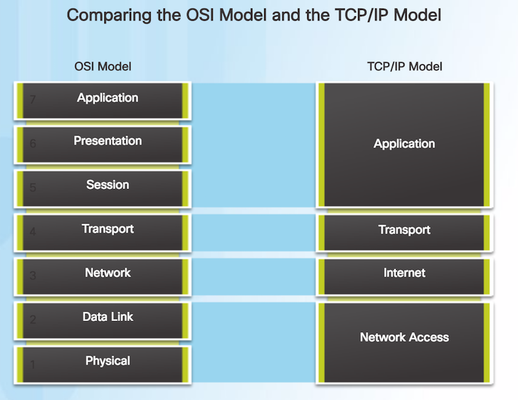
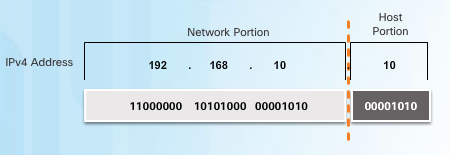

### 企業資料通訊TA 4

---

因應這[消息](https://goo.gl)，所以短網址也緊急更換XD
<p style="font-size:50px;text-decoration:line-through;"> goo.gl/LiNPag </p>
<p style="font-size:100px; font-family:monospace; color:#00DD77">ppt.cc/fl8pwx</p>

---

請大家先下載 
* [Netcad 7.3.2.9](https://1387926.netacad.com/courses/639250/pages/launch-chapter-7) 

---

前次複習:
* 藉由查看PDU，更加認識OSI七層
* DNS
* Layer 1 - 理解各個線材與設備之間的關係
* Layer 2 - Data Link Layer : MAC/ARP

---


<p style="font-size:20px"> 這張圖讓你在期中考前一直看一直看... </p>

---

### DNS
> DNS的全稱是Domain Name System(或Service)，是一套系統軟體，讓大家所使用及管理的電腦網路系統，能夠作領域名稱(Domain name)與位址(IP address)相互之間的轉換

<p style="font-size:20px"> Ref:[甚麼是DNS？](http://dns-learning.twnic.net.tw/dns/01whatDNS.html)</p>

---

Layer 1 ?

---

> Layer 1 實體層 Physical Layer  
> 由於網路媒體只能傳送 0 與 1 這種位元串，因此實體層定義所使用的媒體設備電壓與訊號等， 同時還必須瞭解資料訊框轉成位元串的編碼方式，最後連接實體媒體並傳送/接收位元串。

<p style="font-size:20px"> Ref:[鳥哥的 Linux 私房菜-第二章、基礎網路概念](http://linux.vbird.org/linux_server/0110network_basic.php)</p>

---

Layer 2 ?

---

> Layer 2 資料鏈結層 Data-Link Layer  
> 這一層是比較特殊的一個階層，因為底下是實體的定義，而上層則是軟體封裝的定義。因此第二層又分兩個子層在進行資料的轉換動作。 在偏硬體媒體部分，主要負責的是 MAC (Media Access Control) ，我們稱這個資料包裹為 MAC 訊框 (frame)， MAC 是網路媒體所能處理的主要資料包裹，這也是最終被實體層編碼成位元串的資料。

---

>MAC 必須要經由通訊協定來取得媒體的使用權， 目前最常使用的則是 IEEE 802.3 的乙太網路協定

> 至於偏向軟體的部分則是由邏輯連結層 (logical link control, LLC) 所控制，主要在多工處理來自上層的封包資料 (packet) 並轉成 MAC 的格式， 負責的工作包括訊息交換、流量控制、失誤問題的處理等等。

<p style="font-size:20px"> Ref:[鳥哥的 Linux 私房菜-第二章、基礎網路概念](http://linux.vbird.org/linux_server/0110network_basic.php)</p>

---

那開始進入今天的課程啦~

---

目標：

* Layer 3 - IP , Default Gateway
    * [PT]PT Test
* [PT] 7.3.2.9
    * 熟悉ping,tracert,nslookup
* Layer 3 - IP,Subnet Mask

---

### Layer 3 - IP , Default Gateway

---

一樣來上一張傳統的圖

---


---

在這裡先幫大家補充一件事

---

localhost/127.0.0.1/[::1]

這三個指的是同一件事!!!

都代表著本機，但是以不同形式表達

---

所以 ping 這些一定會通，因為就是 ping 自己啦  
(當然，若不通的話，就代表你的網路連接裝置有問題，這同時也可以確認自己的網路設備正常與否)

---

那這個[笑話](http://ottoshare.blogspot.tw/2012/04/localhost127001.html)大家應該就看得懂啦~~~

---

Default Gateway
* Routes traffic to other networks.
* Has a local IP address in the same address range as other hosts on the network.
* Can take data in and forward data out.

---

簡單來講，就是你需要一台設備幫你對外溝通啦!  
若以ipv4表示，常見Default Gateway的最後一碼會設為1或254，當然不一定都是如此設定!!

---

這裡就直接上[戰場](https://1387926.netacad.com/courses/639250/assignments)了  
(過去式)

---

阿不過在上戰場之前，還是讓我準備一下給西  
(強烈建議你們先複習一下 TA2 的東西還有下面的tips)

---

Tips

---

看設定

```
show run

```

---

進入設定模式

```
config t

```

---

進入特權

```
enable

```

---

保護各種線(這次考試應該有三條)

```
Router(config)# line vty 0 4
Router(config-line)# password test
Router(config-line)# login

Router(config)# line console 0
Router(config-line)# password test
Router(config-line)# login

```

---

設定switch的vlan ip,mask address,default gateway

```
interface vlan 1
ip address 172.16.5.2 255.255.255.0
ip default-gateway 172.16.5.1
no shutdown

```

---

在Router中設定 gigabitEthernet 0/0

```
config t
interface gigabitEthernet 0/0
ip address 172.16.5.1 255.255.255.0
#下面這行是幫你設定的東西增加description
#switch的vlan也要進入之後再用以下這些設定
description r111
no shutdown
```

---

Document interfaces with <mark>descriptions</mark>   
on the <mark>Housing router interfaces</mark> and the   
 <mark>XXXXX switch virtual interface</mark>.

---

Save your configurations.

That is, you need to copy <mark>one router and two switch</mark> <mark>from running-config to startup-config</mark>   
in order to save the configuration

---

不知道大家看到這些  
有沒有回想起自己輸入這些指令的畫面呢?


---

### [PT] 7.3.2.9

---

 
打開[Netcad 7.3.2.9](https://1387926.netacad.com/courses/639250/pages/launch-chapter-7) 

---

要達成的目標: "PC1" to "dualstackserver.pka(網址)"

---

請找出連線的問題

---

參考步驟

1. ping [自己的ip]
2. tracert [要連線的ip]
3. nslookup [要查詢的域名]

---

[鳥哥的 Linux 私房菜第五章 - Linux 常用網路指令](http://linux.vbird.org/linux_server/0140networkcommand.php#network_test)

上面連結詳細介紹了ping,tracert,nslookup等常用指令

---

間單來講
* ping : 丟封包測試之間連線
* tracert: 一樣測試連線，但會列出經過的點
* nslookup: 查 domain name (DNS)

---

藉由參考步驟的幫助，應該可以找到問題了吧?

---

再來試試  
"PC2" to "Dualstackserver.pka/2001:DB8:CAFE:1::10" 
(主機名稱/ipv6)

---

試試看ipv6config吧(比較一下與ipconfig的差別)

---

一樣使用ping,tracert,nslookup 找出可能的問題 

---

這邊會有兩個問題，一個是ipv6的問題  
另一個是在pc2 ipv4的問題

---

最後可以試試看小框框 check results 的功能    
(之後會用到)

---

### Layer 3 - IP , Subnet Mask

---

這禮拜先介紹Subnet Mask的運作方式  
下禮拜再來應用

---

首先用詳細一點的方式介紹 IP

---

ipv4 address組成為32 bits  
而表示方式為切成四組後，  
以 . 分開轉成十進位做表示  

Link: [IP Calculator](http://jodies.de/ipcalc)

---

每一個網路中，都會有許許多多的IP  
那有些規定是要知道的

---

<!-- .slide: style="text-align: left;"> -->  
Network Address : 用來識別網路所在  
Host Address ： 用來識別在那個網路中所在的位置


---

<!-- .slide: style="text-align: left;"> -->  
Host Address全為0 -> 這個address代表 Network 本身  
Host Address全為1 -> 代表針對網路做broadcast

<mark>所以在每個網路中，上面這兩個address會被保留</mark>

---

### IP CLASS 劃分

---


Link:[第二章、基礎網路概念-分級 (Class A, B, C)](http://linux.vbird.org/linux_server/0110network_basic.php#tcpip_network)

---

從上面這些介紹後，你應該會知道 192.68.16.234  
是屬於哪個class級別，又它的 network address  
是什麼了吧

---

### public ip vs private ip

---

在每個class中，會將特定的位置保留起來，  
做為private ip 使用

---

private ip 區段

* Class A  : 10.0.0.0 – 10.255.255.255
* Class B  : 172.16.0.0 – 172.31.255.255
* Class C  : 192.168.0.0 – 192.168.255.255

---

所以請記得看到private ip ，就要知道它沒辦法直接  
對外連線，必須透過public ip

---

要是你是ptt鄉民，你應該就可以知道    
在臺灣學術網路的 ip 開頭為140  
而偉哉東方哈佛的 ip 則為140.119  
那你應該也能知道我們有多少 public ip 了吧?

---

private ip 就是因為 public ip 的稀缺性而規劃的  
當然，ip的缺少也有其他的解決方案，像是ipv6

---

### subnet mask

---

有沒有發現若只依照Class劃分，會有一個大麻煩

---

當一家公司只有不到十台的電腦，而它需要一個public ip 時，你給它 class c 的 ip會發生什麼事....

---

它共有 2^8 = 256 個 host可以用  
可是它根本不需要這麼多啊...  
照這樣分的話，全世界一下子就分完了

---

所以就發展了subnet 與 supernet

---

每一家公司透過 subnet 與 supernet 可以再  
重新劃分自己要的ip位置

---

這邊就只講 Subnet

---

運用Subnet Mask來劃分網段，   
用Subnet Mask與IP做&運算後，    
可以知道它們是否為同個 Subnet

---

來切切看subnet吧

---

若有一個network address為 192.168.100.0  
每個單位需要25個ip，所以要怎麼切呢?

---

$$ 2^4 < 25 < 2^5 $$

---

subnet mask: 255.255.255.11100000(192+64+32=224)

---

subnet mask最後一個區段的前三碼組合分別為  000,001,010,011,100,101,110,111

---

所以可以知道共切成 8 個 subnet  
而當中每個 subnet 又有 30 個 host 可以用
$$ (2^5 - 2) $$
扣掉host全為0與host全為1的兩個  
這邊也就是為什麼每個單位25個 ip 要這樣切的原因

---


---

後面的請自己補齊啦~~

---

### 作業來啦!!!

---

作業的要求：

1. 在PC1 上 nslookup dualstackserver.pka 成功 的截圖
2. 在PC2 上 tracert 2001:DB8:CAFE:1::10 成功 的截圖
3. 192.168.100.0分成8個subnet的分配表，請依照投影片中的格式

---

繳交方式：

1. 將做完的截圖及表格，做成一份文件檔( docx / markdown / pdf / odf )，上傳到 WM5 的作業四

---

繳交時間:

下禮拜三TA課前