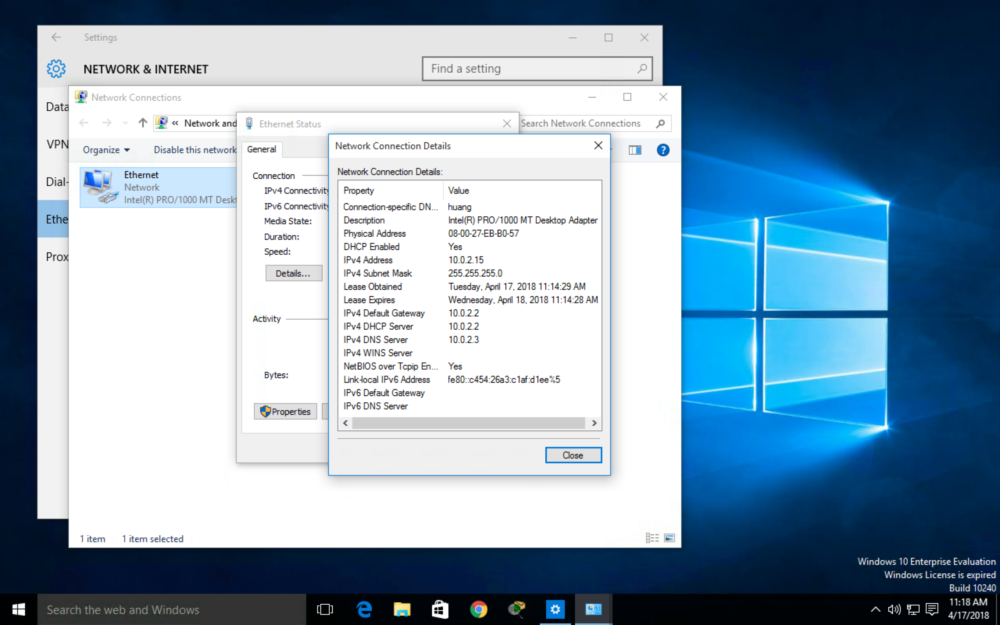
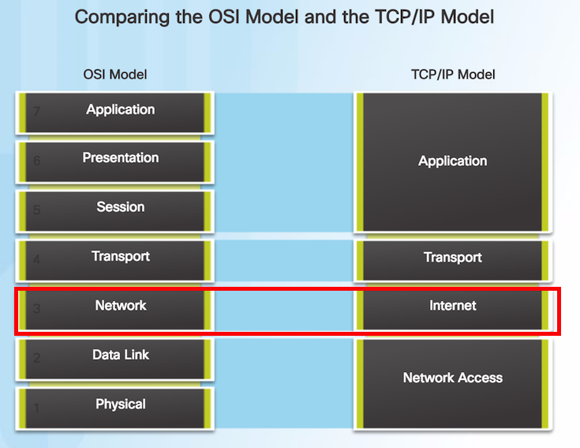
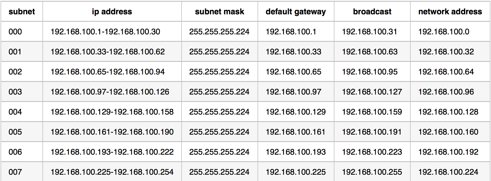

### 企業資料通訊TA 5

---

<p style="font-size:150px;"> ppt.cc/fl8pwx </p>

---

請大家先下載 
* [Netcad 8.1.4.7](https://1387926.netacad.com/courses/639250/pages/launch-chapter-8)

---

前次複習：

* Layer 3 - IP , Default Gateway
    * [PT]PT Test
* [PT] 7.3.2.9
    * 熟悉ping,tracert,nslookup
* Layer 3 - IP,Subnet Mask

---

<p style="font-size:25px;float:left;margin-left:30%" class="fragment highlight-red">IP,</p>
<p style="font-size:25px;float:left" class="fragment highlight-red">Subnet Mask,</p>
<p style="font-size:25px;float:left" class="fragment highlight-red">Default Gateway,</p>
<p style="font-size:25px;float:left" class="fragment highlight-red">DNS</p>


---

學校的網路設定???

---

<p style="text-align:left">
ip : 140.119.[區網數字].xxx  
subnet mask : 255.255.255.0  
default gateway : 140.119.[區網數字].254  
dns server : 140.119.1.110  
dns server : 140.119.252.12  
</p>

* <p class="fragment">請問是class幾的ip?</p>
* <p class="fragment">為什麼subnet mask要設成**255.255.255.0**?</p>
* <p class="fragment">default gateway一定是254?</p>
* <p class="fragment">dns 我不要用學校的可以ㄇ</p>

---

再介紹一下ip跟subnet之間可以簡寫成 140.119.19.0/24  
/24 指的就是 subnet mask 中 1 的有24個啦  
也就是subnet mask為255.255.255.0的意思
要記得啊~~~

----

那上禮拜畫的table的設定可以簡寫為???
<p class="fragment">192.168.100.0/27</p>

---

目標:
* [PT]Subnet Mask 實作
* CSE 1
* CSE 2

---



---

### [PT]Subnet Mask 實作

---

大家上禮拜應該都有順利寫出下面這張表了  
那就來用用看吧!!

---



---

在這裡要注意的是，default gateway  
是自己從可用的ip address中挑一個出來用  

---
 
default gateway可自由設定  
只是通常使用該區段可用ip中的第一個或最後一個

---

而在這個練習中  
default gateway是每個區網第一個可用ip

---

1. 為R1的G0/0,G0/1分配適當的ip address,subnet mask
2. 為S3設定它的ip,subnet mask，它的ip為區網中第二個可用ip，並設定 default gateway
3. 為PC4設定好它的網路設定，ip用它那個子網段最後一個ip

---

從題目中可知  
Step 2: Assign the subnets to the network  
shown in the topology.
* Assign Subnet 0 to the LAN connected to the GigabitEthernet 0/0 interface of R1:
* Assign Subnet 1 to the LAN connected to the GigabitEthernet 0/1 interface of R1:
* Assign Subnet 2 to the LAN connected to the GigabitEthernet 0/0 interface of R2:
* Assign Subnet 3 to the LAN connected to the GigabitEthernet 0/1 interface of R2:
* Assign Subnet 4 to the WAN link between R1 to R2:

---

* 為R1(Router)的G0/0,G0/1分配適當的ip address,subnet mask

```q
enable
config t
interface gigabitEthernet 0/0
ip address 192.168.100.1 255.255.255.224
no shutdown
exit

interface gigabitEthernet 0/1
ip address 192.168.100.33 255.255.255.224
no shutdown

```

---

* 為S3(Switch)設定它的ip,subnet mask，它的ip為區網中第二個可用ip，並設定 default gateway

```q
enable
configure terminal
interface vlan 1
ip address 192.168.100.66 255.255.255.224
no shutdown
exit
ip default-gateway 192.168.100.65

```

---

* 為PC4設定好它的網路設定，ip用它那個子網段最後一個ip

```q
ip:192.168.100.126
subnet mask:255.255.255.224
default gateway:192.168.100.97

```

---

將網路圖及check result為成功完成的截圖給我吧!!

---

### CSE 1

---

教師版的投影片幾乎沒有修改就直接上傳到netacad啦

---

那來看投影片啦~

---

### CSE 2

---

教師版的投影片幾乎沒有修改就直接上傳到netacad啦

---

那來看投影片啦~

---

補充：XSS

> 跨網站指令碼（英語：Cross-site scripting，通常簡稱為：XSS）是一種網站應用程式的安全漏洞攻擊，是代碼注入的一種。它允許惡意使用者將程式碼注入到網頁上，其他使用者在觀看網頁時就會受到影響。這類攻擊通常包含了HTML以及使用者端腳本語言。
> 參考至維基百科

---

[DEMO](https://t-rain.github.io/nccu-bdc-106/xss/vul-client.html)

---

### 作業來啦!!!

---

作業的要求：  

1. 將成功完成的8.1.4.7網路圖及check result的截圖給我吧

---

繳交方式：

1. 將做完的截圖做成一份文件，上傳到 WM5 的作業五

---

繳交時間:

下禮拜三TA課前