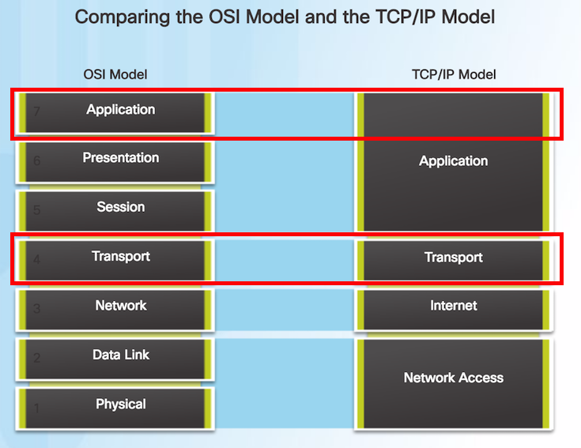
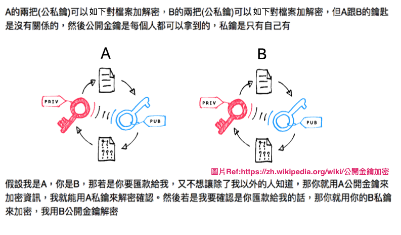
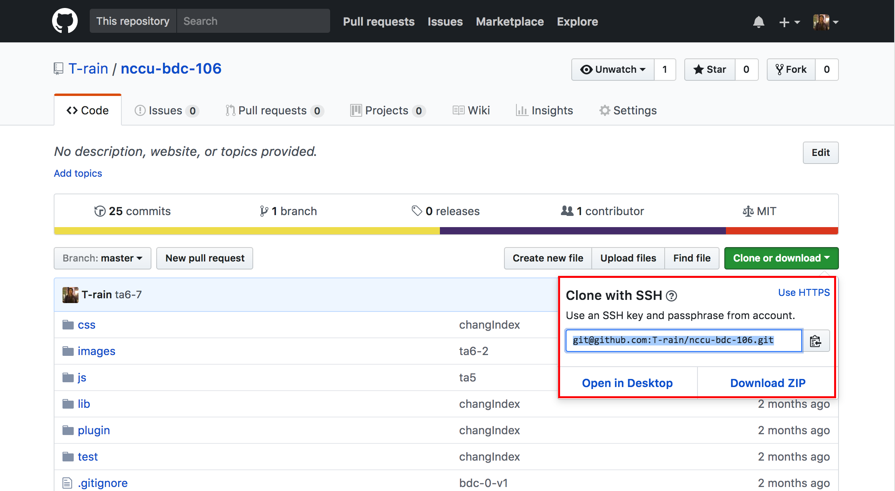

### 企業資料通訊TA 6

---

<p style="font-size:150px;"> ppt.cc/fl8pwx </p>

---

前次複習:
* <a href="#/4/50">IP</a>
* <a href="#/4/63">Subnet Mask</a>
* <a href="#/4/20">Default Gateway</a>
* <a href="#/4/5">DNS</a>
* <a href="#/5/29">XSS</a>

---

請分別說出代表的意義吧!!

---

目標：

* Layer 4 - TCP/UDP
* Layer 4 - Port
* Layer 7 - Application layer
* DEMO with live-server
* CSE4
* Git/Github With SSH key
* [PT]11.5.1.2(Optional)

---



---

## Layer 4 - Transport Layer

TCP/UDP

---

兩個通訊之間的穩定性(TCP)、實作、Port管理等  
都是Layer 4 所定義的

---

像是TCP著名的[三手交握](https://blog.jason.party/7/three-way-handshake)

PS:同時這也是資安起手式喔XD

---

TCP vs UDP  
可靠 vs 不可靠  
易達QoS vs 不易達 QoS  
慢 vs 快  

---

## Layer 4 - Port

---

Socket Address => IP address + Port Number  
(每個網路服務 => 由 IP address + Port 組成)

---

每個系統可以跑很多個服務  
那在同一台電腦上的服務要如何區別  
而能夠跟外界溝通呢?

---

就是使用Port來區別

---

那同時也要記得，每個 IP 可以有多個port  
那到底有多少Port呢?

---

Port Number Groups
* The [IANA](https://www.iana.org/) has created three port number groups:
* Well-known ports (0 to 1023)
* Registered Ports (1024 to 49151)
* Private and/or Dynamic Ports (49152 to 65535)

---

理論上每個Service都會有一個常用的Port   
但是也可以自己改XD

---

在讓大家看什麼是service跟port前  
要先講一些事情

---

## Layer 7 - Application layer

---

應用層 ~~ 也就是指各種應用/服務所在的那層啦

---

在這裡就介紹一下各種服務以及相對應的port

---

網路的各種協定(第一層到第七層)  
很多都被規定在[RFC](https://www.ietf.org/rfc.html)裡頭  
也就是最原汁原味的敘述
像是[HTTP Over TLS](https://tools.ietf.org/html/rfc2818)

---

* Web
    * 協定:http/https
    * port: 80/443(insecure/secure)
* Email
    * 協定:smtp/pop3
    * port:25/465(insecure/secure)
* PT 10.2.1.7

---

* DHCP
    * 動態指定ip
* DNS
    * port:53
* PT 10.2.2.7

---

* FTP
    * 檔案傳輸
    * port:21
* 10.2.3.3

---

* SSH/SFTP/SCP
    * port:22
* 11.2.4.5

---

以上這些都可以自己架設看看相對應的service  
而相對應的 PT 也都寫在底下了

---

## DEMO with live-server

---

我們將使用 live-server 啟動  
三個簡單的static file server服務  
並開在不同的 port

---

這邊建議大家安裝在自己的電腦上，之後會用到的XD
那就從環境安裝開始吧

---

環境安裝:
* [Node.js](https://nodejs.org/en/) 
* [Git](https://git-scm.com/)

---

安裝 Node.js

---

* [Node js 官網](https://nodejs.org/en/)
* [nvm](https://github.com/creationix/nvm)(option)

可以直接從官網下載安裝檔安裝  
或用套件管理工具安裝

---

套件管理工具選擇推薦

* windows
    * 有是有，不過沒有推薦...
* mac
    * homebrew,homebrew-cask
* linux
    * yum , apt-get ....

---

Terminal選擇推薦

* windows
    * [Cmder(full version)](http://cmder.net/)
* mac
    * [iTerm2](https://www.iterm2.com/)
* linux
    * 內建，不過有shell可以換(bash/zsh/fish)

---

套件安裝工具通常就是裝完後，下指令就可以安裝完該套件了，像是git  
* brew install [套件名稱]
* apt-get install [套件名稱]
* yum install [套件名稱]

---

安裝 Git

---

* windows
    * https://git-scm.com/downloads
    * 或是可以選擇[Cmder(full version)](http://cmder.net/)，裡頭有安裝好一些常用的指令工具了，像是git，它就是一個[具有 Linux 溫度的 Windows 命令提示](https://blog.miniasp.com/post/2015/09/27/Useful-tool-Cmder.aspx)
    * Cmder full version整合了比較多的東西，當然容量也比較大就是了...
* mac
    * brew install git
* linux
    * yum install git/apt-get install git
    * [開始 - 安裝 Git](https://git-scm.com/book/zh-tw/v1/%E9%96%8B%E5%A7%8B-%E5%AE%89%E8%A3%9D-Git)

---

這堂課無法cover git 教學  
要是想更加了解git的同學，可以參考
* [連猴子都能懂的Git入門指南](https://backlog.com/git-tutorial/tw/intro/intro1_1.html)
* [Try Git](https://try.github.io/)

---

這邊只會讓大家體會一下git用法

---

題外話，git/github 不是一樣的東西喔

---

[github](https://github.com/),[bitbucket](https://bitbucket.org/),[gitlab](https://about.gitlab.com/) 比較相似  
都是屬於遠端的 git repository 服務

---

[git](https://git-scm.com/),[svn](https://subversion.apache.org/),[cvs](https://www.nongnu.org/cvs/) 才比較類似  
都屬於版本控制系統

---

那來打開live-server這個套件/service的[github](https://github.com/tapio/live-server)

---

從 README.md 的 Installation Part開始吧!!

---

這裡就不用最簡單的方式(Npm way)  
用 Manual way 操作給大家看

---

```Bash

#從github網頁上找到網址clone下來到所在目錄
git clone https://github.com/tapio/live-server
#移動到live-server這個目錄
cd live-server
# npm安裝套件指令，-g 為 Install globally，也就是在哪個目錄下都可以用
npm install -g 

```

---

裝完後，可以clone看看[助教課投影片github網址](https://github.com/T-rain/nccu-bdc-106)

---

移動到nccu-bdc-106/slide6Html資料夾  
接著進到裡頭的資料夾  
並一個一個指定不同的port啟動

---

```Bash
#移動到主目錄
cd nccu-bdc-106/slide6Html
#移動到10080這個資料夾
cd 10080 
#啟動 live-server 並指定在10080 port 啟動
live-server --port=10080
#回到上一層
cd ..
#以此類推...
cd 20080
live-server --port=20080
cd ..
cd 30080
live-server --port=30080

```

---

理論上會自己打開瀏覽器，你可以看到一件事  
我們在本機上分別在port 10080/20080/30080上開了三個static server service

---

而同理我們也可以在其他的port上開  
各種服務:資料庫、網站、cache、message queue等等

---

題外話，上面那個是開發用的工具  
你在檔案修改後可以自動重整，不用在browser裝外掛  
前端開發時很有用XD

---

## CSE 4

---

先來看CSE投影片內容，再回來看接下來的東西

---

非對稱式加密

---



---

## Git/Github With SSH key

---

我們現在要將 ssh key 加到自己的github帳號裡頭  
之後push/pull都可以透過 ssh 進行  
(再也不用輸入帳號密碼)

---

那首先要生成SSH金鑰

---

* windows
    * [Cmder(full version)](http://cmder.net/)(終端機模擬器)
        * ssh-keygen
    * 或是[putty](http://www.putty.org/)的圖形化操作
* mac/linux
    * ssh-keygen

---

Ref:
* [設定SSH連接](https://backlog.com/git-tutorial/tw/reference/ssh.html)  
* [Generating a new SSH key](https://help.github.com/articles/generating-a-new-ssh-key-and-adding-it-to-the-ssh-agent/#platform-mac)
* [putty使用經驗談 ( Pageant, puttygen )](http://blog.xuite.net/night.cola/blog/30661866)

---

擁有一個[github](https://github.com/)帳號

---

登入後
1. 右上角個人資訊->Settings
2. 進入Profile後->點選SSH and GPG keys
3. 按 New SSH key
4. 請記得是將public key加入(id_rsa.pub裡頭的內容)
5. 請記得好好保存private key(id_rsa)，不要讓別人拿到或知道

---

加完之後，你的 private key 就可以當作登入認證  
github會用你的 public key 來判斷授權   

---

你push code之類的就可以不用再輸入密碼啦  
原理的部分就類似剛剛所講的

---

你可以看到跟原本clone的remote位置不同

---



---

最重要的是請將你加入完ssh key的畫面截圖給我看  
Fingerprint你要塗掉沒問題的...

---

Ref:[Connecting to GitHub with SSH](https://help.github.com/articles/connecting-to-github-with-ssh/)

---

### [PT]11.5.1.2(Optional)

---

大家可以去做做看PT 11.5.1.2  
讓大家為下次考試做準備

---

### 作業來啦!!!

---

作業的要求：

1. 請將自己github上設定好ssh key的畫面截圖

---

繳交方式：

1. 將做完的截圖，上傳到 WM5 的作業六

---

繳交時間:

下禮拜三TA課前