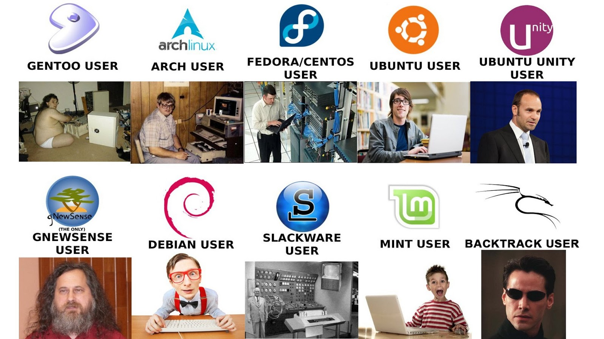

### 企業資料通訊TA 7

---

 ppt.cc/fl8pwx 

---

前次複習:
* Layer 4 - TCP/UDP,Port
* Layer 7 - Application layer
* Git/Github With SSH key

---

<a href="#/6/21">Layer 4 / Layer 7</a>

1. 
Application vs Port ???

2. 
舉出常見的application

3. 
上次為什麼助教要開三個頁面?

---

<a href="#/6/36">Git/Github With SSH key</a>

1. 
Git常用指令有哪些呢??

2. 
Github跟Git有關係??

3. 
非對稱式加密??

4. 
SSH又是什麼??

5. 
SSH的金鑰呢??

---

目標：

* CSE3
* Install Virtual Box and Ubuntu

---

請大家去 [Netacad CSE](https://1387926.netacad.com/courses/639353/modules) 找到 `CSE3` 投影片

---

那就開始看投影片啦

---

### Install Virtual Box and Ubuntu

---

在這裡我只是希望能夠有個 Unix 的環境方便操作  
所以你想用 Mac/Ubuntu/CentOS 或是更多更潮的  
都是可以的

---

---

個人認為 Mac 對於新手開發者而言是更為友善的  
尤其有Homebrew的加持，大大降低安裝library門檻    
不過我想Mac電腦的持有率不高，所以要教大家在Windows上安裝Virtualbox  

---

但我之後會同時提到在 Mac/Ubuntu 上要怎麼做之後的作業
(基本上大同小異)，當然要是你是 Windows  
神人，作業可以弄得出來，我也不反對XD

---

基本上，你有下列幾種方式取得 Unix 的環境

* 直接重灌一台電腦
* VM (VirtualBox,Vmware,Parallels,Hyper-v)
* 雲端SaaS(AWS,GCP,DigitalOcean,Linode)
* Docker

---

重灌的同學可以參考怎麼製作開機隨身碟  
Ref: [Rufus製作Ubuntu 16.04 USB安裝隨身碟](http://blog.xuite.net/yh96301/blog/450717778-Rufus%E8%A3%BD%E4%BD%9CUbuntu+16.04+USB%E5%AE%89%E8%A3%9D%E9%9A%A8%E8%BA%AB%E7%A2%9F)

---

不過重灌的話要注意的事情就是
* 那台機器如何從隨身碟開機  (要怎麼從boot menu  
啟動)  
* 隨身碟是確定有做好的  (Rufus是我前幾天用的啦，其他的軟體也是可以，就看大家選擇了)

---

安裝 Virtual Box

---

這個步驟應該可能會遇到的問題是有些電腦沒有開Virtualization Technology(VT)  
這時請先查一下你那台電腦要怎麼開

---

以下幾個連結參考

Ref: [怎麼在BIOS中開啟VT？BIOS開啟VT虛擬化技術圖文教程](https://read01.com/4APAO3.html)

Ref: [[VM]virtualbox沒有出現64bit作業系統的安裝方式](http://melayogu.pixnet.net/blog/post/140458490-%5Bvm%5Dvirtualbox%E6%B2%92%E6%9C%89%E5%87%BA%E7%8F%BE64bit%E4%BD%9C%E6%A5%AD%E7%B3%BB%E7%B5%B1%E7%9A%84%E5%AE%89%E8%A3%9D%E6%96%B9%E5%BC%8F)

---

要是沒有遇到上述問題，那就不用理以上步驟啦  
或是選擇找一台電腦直接灌一套Ubuntu；  
用SaaS的同學，應該也不會遇到上面問題  

---

安裝好 VM軟體後，來開個虛擬機安裝Ubuntu啦  
Ref: [VirtualBox 5.2安裝Ubuntu 16.04](http://blog.xuite.net/yh96301/blog/list-view/432341564)

---

Virtual Box操作

---

照著光碟安裝完之後及設定完之後  
你應該就有一個Ubuntu作業系統了!!

---

當然這次是用Ubuntu做範例  
之後可能會用kali linux或是你們可以  
試試安裝其他作業系統(Windows,黑mac,CentOS)

---

回到Ubuntu  
打開terminal(ctrl+alt+t)  
下 lsb_release -a / uname -a

---

請截圖讓我知道你有了這個環境

---

### 作業來啦!!!

---

作業的要求：  

1. 一個 Unix like 系統的桌面畫面截圖，  
並輸入上述指令

---

繳交方式：

1. 將做完的截圖，上傳到 WM5 的作業七

---

繳交時間:

下禮拜三TA課前