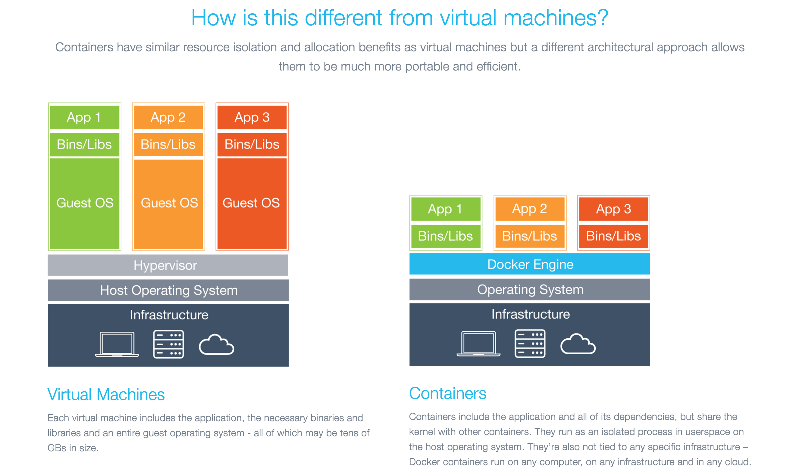
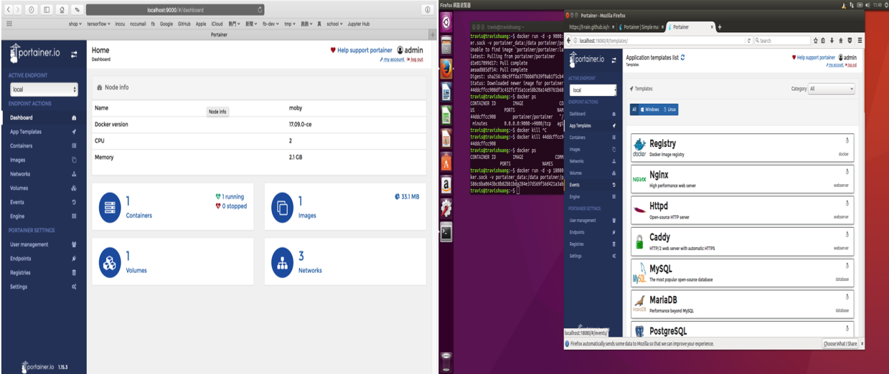

### 企業資料通訊TA 9

---

<p style="font-size:150px;"> ppt.cc/fl8pwx </p>

---

前次複習:

* Static Route 設定
* Install SSH Server

---

<a href="#/8/8">Static Route</a>

1. <p class="fragment">指令總共三個參數，前兩個的意思?</p>
2. <p class="fragment">最後一個指的是?</p>

---

<a href="#/8/17">SSH Server</a>

1. <p class="fragment">SSH到底是什麼?</p>
2. <p class="fragment">Client/Server?</p>
3. <p class="fragment">Port Forwarding是什麼意思?</p>
4. <p class="fragment">為什麼我們上次需要Port Forwarding?</p>

---

目標：

* CSE 6
* Docker
* Portrainer

---

CSE 6

---

請大家去 [Netacad CSE](https://1387926.netacad.com/courses/639353/modules) 找到 `CSE6` 投影片

---

接下來都是別的東西啦XDD

---

不過在正式進入之前  
我們先再次整理一下到目前為止我們所知道的事情

---

1. 10.0.2.15:80
2. 140.119.168.10:8080
3. www.nccu.edu.tw/24

---

IP ?  
私有/公有 ?  
Subnet Mask ?

---

DNS ?  
DNS Server ?

---

Port ? 用途 ?   
www.nccu.edu.tw == 140.119.168.10:8080 ?    

---

Port Forward ?  
140.119.168.10:8080 -> 10.0.2.15:80 ?

---

VM ?  
Host vs Guest ?

---

### Docker

---

Docker在最近幾年紅了起來   
而且已經被廣泛運用了

---

[iThome Container Summit 2015 筆記 | 談 Docker 對傳統 DevOps 工具鏈的衝擊 - 葉秉哲](http://blog.chengweichen.com/2016/01/ithome-container-summit-2015-docker.html)

---

Docker是以服務為導向的技術

---

以往都是一台VM上有很多的服務

---

但是Docker是一個container一個服務

---



---

服務包含了各式各樣  
最底層的OS甚至到最高階的Web應用

---

最希望的就是達成一個container一個服務

---

也可以從另外一個角度切入介紹  
[Docker 基礎介紹與實戰](https://blog.wu-boy.com/2016/04/introduction-to-docker/)

---

那來用用看吧

---

先來安裝 Docker

---

[How To Install and Use Docker on Ubuntu 16.04](https://www.digitalocean.com/community/tutorials/how-to-install-and-use-docker-on-ubuntu-16-04)  

---

第二部分雖然是Optional    
但不做的話，之後下 docker 指令要記得加 sudo

---

有遇到畫面不能離開的話可以試著按 q 或 ctrl-c

---

順便補充一下

---

要是你不小心進入了指令式文本編輯的畫面  
像是nano或vim  
* nano離開的方式(下面會提示啦) -> `ctrl + x `
* vi / vim 離開的方式 -> `:q!`

---

For Mac的同學

---

[Install Docker For Mac](https://docs.docker.com/docker-for-mac/install/#what-to-know-before-you-install)

---

安裝完之後試試按下

```
docker ps

```
---

把上面指令的截圖給我

---

Portainer - Simple management UI for Docker 

---

先來安裝之後再來講這什麼東西

---

[Install Portainer](https://portainer.io/install.html)  
就直接照著打吧，別客氣

---

照著目前的官網指令做的話  
會創建一個volumn portainer_data   
並掛載兩個volumn /var/run/docker 和 portainer_data
並且會幫你做port forward -> 9000:9000(host:guest)

---

那就把畫面開起來吧

---

進入到首頁之後截圖給我

---

完成的範例大概是這樣子

---

Mac vs Ubuntu


---

那講一下這個我覺得很不錯的Docker UI 工具

---

這個東西讓你一開始不用下任何 Docker 指令  
就馬上能體驗 Docker 的魅力

---

而之後等會用docker指令之後  
用這個介面維護也是不錯的選擇

---

來看看什麼叫不用下任何指令

---

它有 App Templates 讓你幾乎無設定  
就啟動一個服務的Container

---

當然有好有壞啦  
就可能你起來之後  
還是不曉得 Docker 怎麼運作

---

還是希望大家可以自己再去研究一下Docker

---

指令啟動container的話  
另外推薦docker-compose  
大家可以回家玩玩看~~~

---

* [How To Install Docker Compose on Ubuntu 16.04](https://www.digitalocean.com/community/tutorials/how-to-install-docker-compose-on-ubuntu-16-04)  

* [Docker-Compose將Drupal網站跟環境設定一次搞定](https://blog.hellosanta.com.tw/網站設計/伺服器/docker-compose將drupal網站跟環境設定一次搞定)

---

### 作業來啦!!!

---

作業的要求：  

2. docker 成功安裝畫面
2. potrainer 首頁畫面

---

繳交方式：

1. 將做完的截圖做成一份文件，上傳到 WM5 的作業九

---

繳交時間:

下禮拜三TA課前